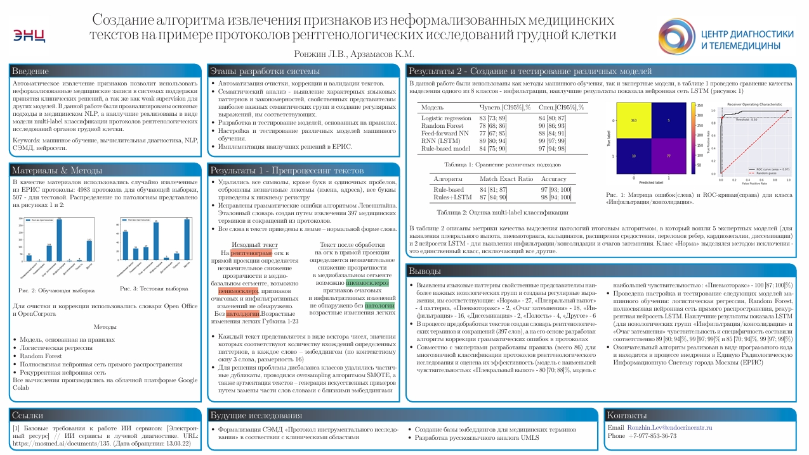

# RG-labeller
* [https://doi.org/10.14341/CBAI-2022-74](https://doi.org/10.14341/CBAI-2022-74) *


[Скачать постер в формате PDF](my_poster.pdf)

## Запуск
* Для запуска необходим интерпретатор Python 3
* Необходимые библиотеки устанавливаются при запуске скрипта (команды рассчитаны на Ubuntu и подобные ей ОС)
* В случае, если библиотеки не установились самостоятельно, необходимо сделать это вручную
## Список зависимостей
* -qq enchant
* pyenchant
* pymorphy2[fast]
* -U pymorphy2-dicts-ru
* gensim
* --upgrade tensorflow
* numpy scipy
* scikit-learn
* pillow
* h5py
* keras
## API
* Скрипт выслушивает порт 9090 и ждет json сообщение следующего формата:
```
  {'description':'при исследвонии органов грудной клетки был обнаружен фиброз легких и скорее всего выпот в плевральной полости',
  'result':'гидроторокс',
  'pneumo':0,
  'focus':0,
  'inf':0,
  'dissem':0,
  'empty':0,
  'norm':0,
  'other':0}
```
* В ответ он отправляет json того же формата, но описание и заключение будут очищены и лемматизированы, а вместо нулей будут вероятности принадлежности к классу
```
{'description': 'при исследование орган грудной клетка быть обнаружить фиброз легкий и скорее весь выпот в плевральный полость',
 'dissem': 0,
 'empty': 0,
 'focus': 0.01029856931041581,
 'hydro': 1,
 'inf': 0,
 'inf_answer': 0.002536445390433073,
 'norm': 0,
 'other': 0,
 'pneumo': 0,
 'result': 'гидроторакс'}
 ```
